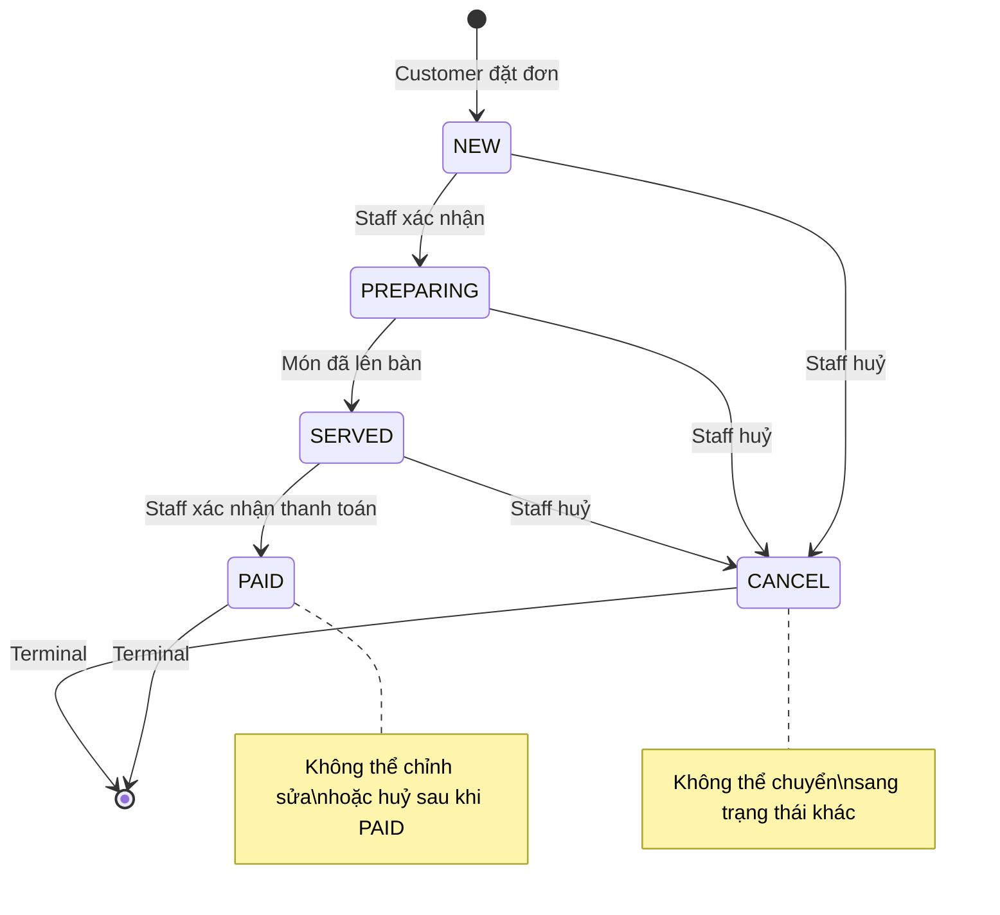
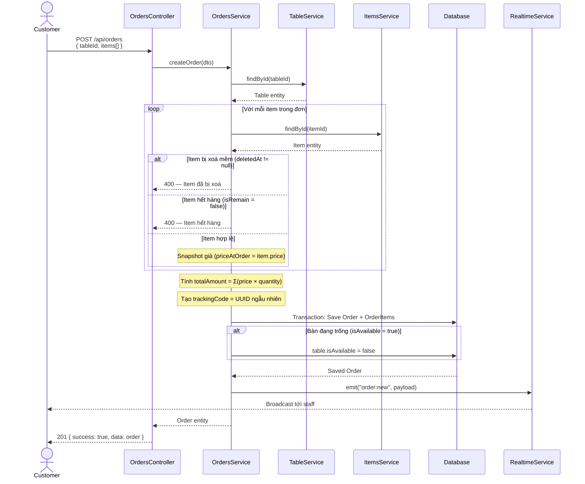
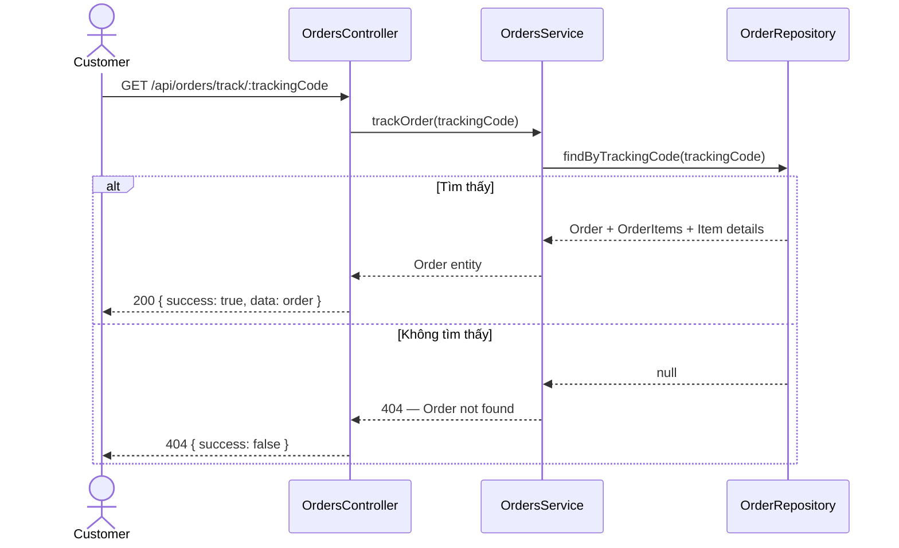
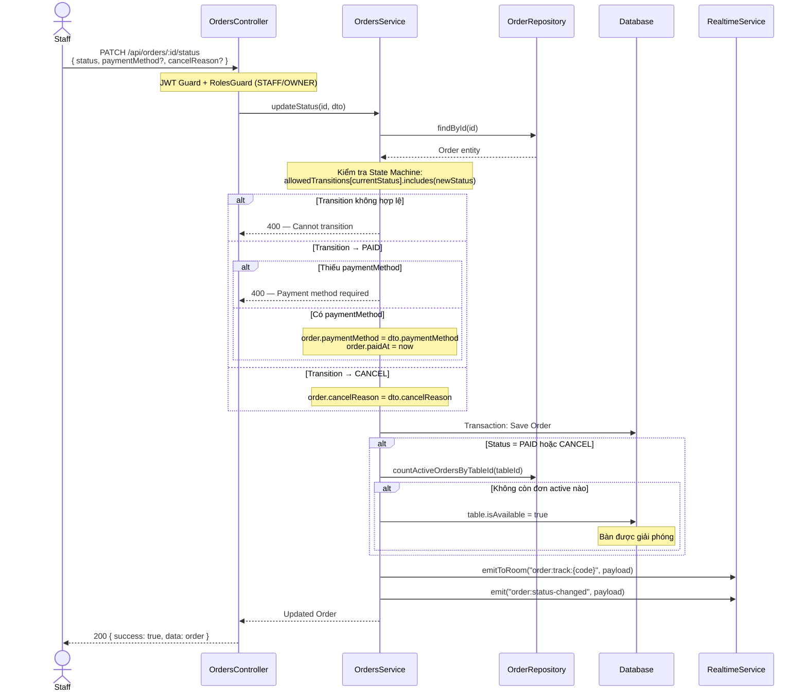
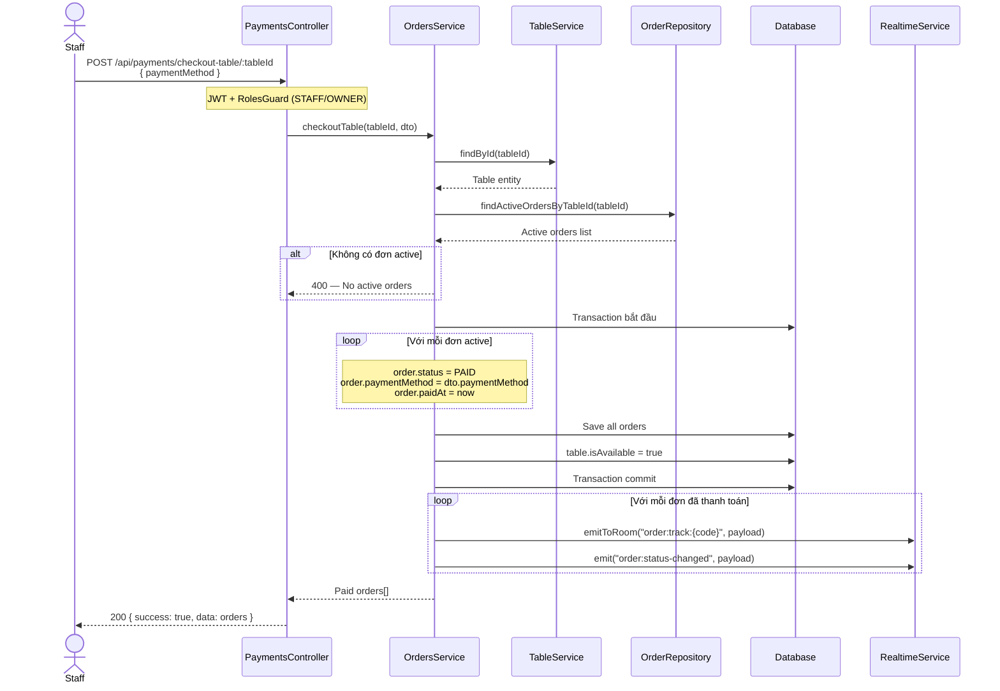
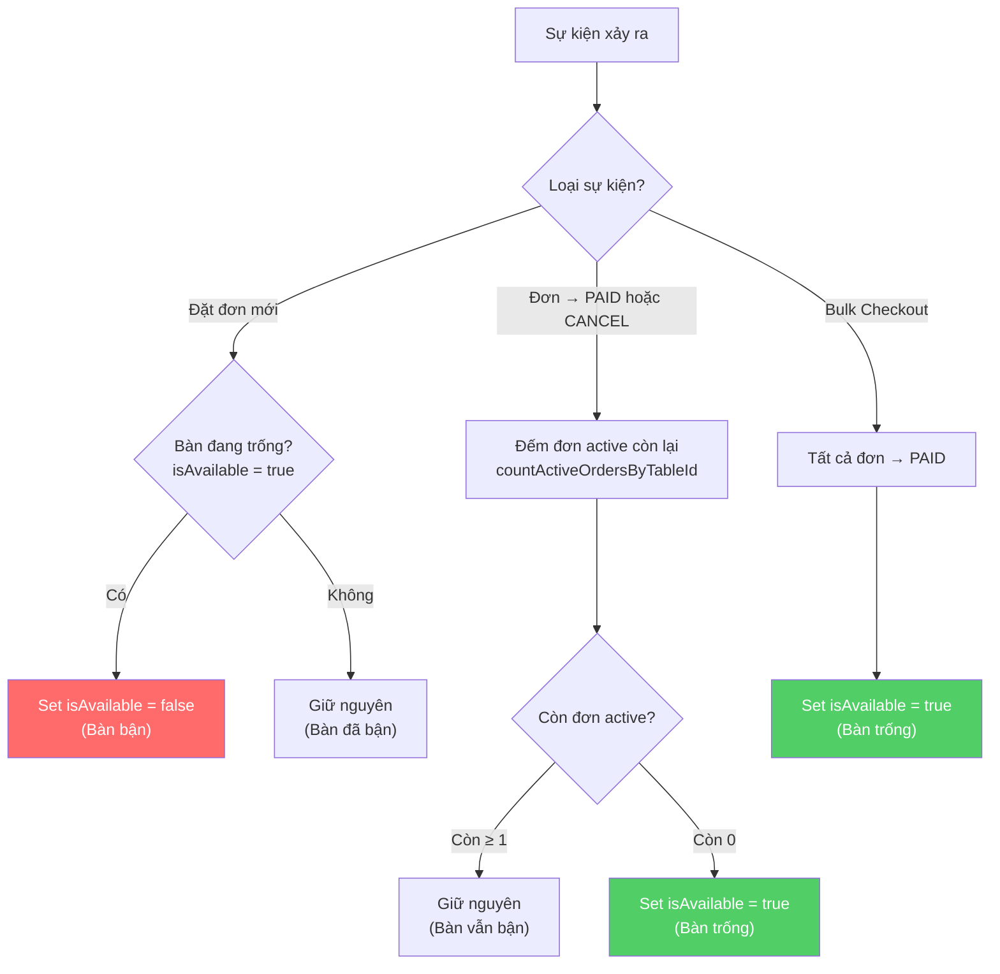
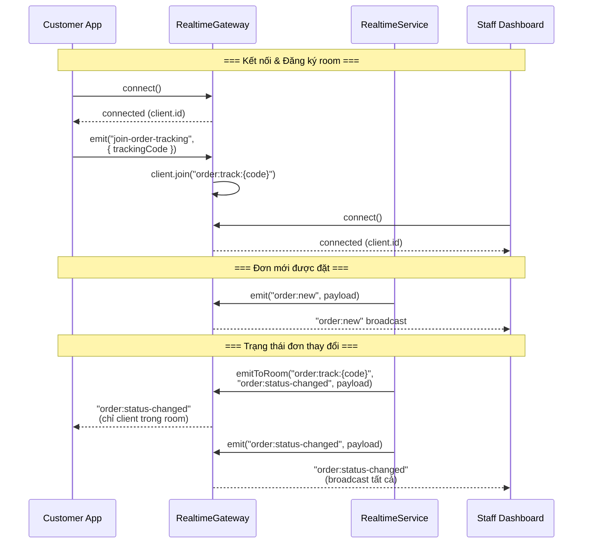

# Order Module — Workflow Diagrams

## 1. Order State Machine

---

## 2. Place Order — Customer Flow

---

## 3. Track Order — Customer Flow

---

## 4. Update Order Status — Staff Flow

---

## 5. Bulk Checkout Table — Staff Flow

---

## 6. Table Availability Sync Logic

---

## 7. WebSocket Realtime Event Flow

