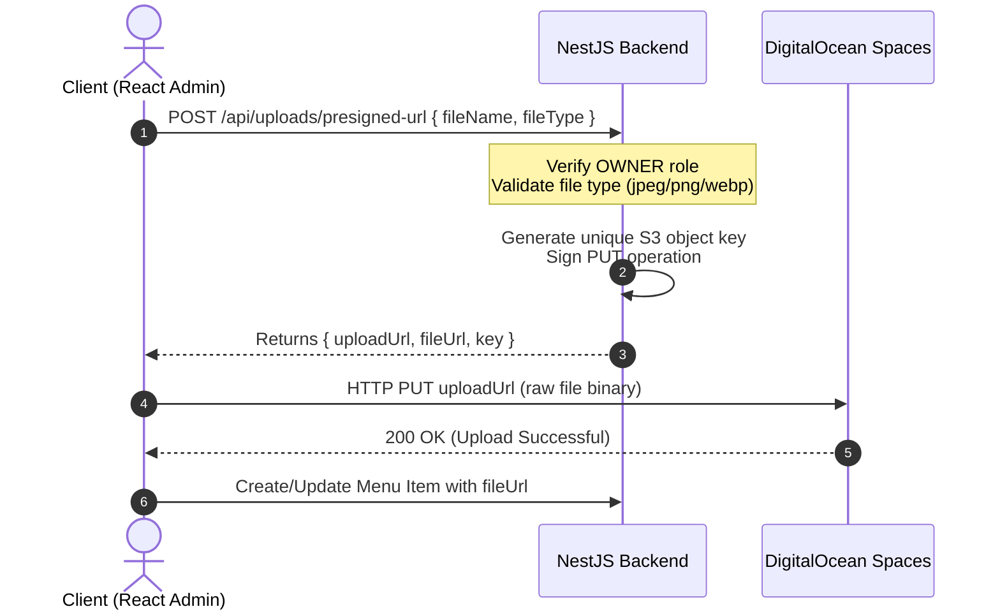

```mermaid
sequenceDiagram
    autonumber
    actor Client as Client (React Admin)
    participant API as NestJS Backend
    participant DO as DigitalOcean Spaces

    Client->>API: POST /api/uploads/presigned-url { fileName, fileType }
    Note over API: Verify OWNER role<br/>Validate file type (jpeg/png/webp)
    API->>API: Generate unique S3 object key<br/>Sign PUT operation
    API-->>Client: Returns { uploadUrl, fileUrl, key }
    Client->>DO: HTTP PUT uploadUrl (raw file binary)
    DO-->>Client: 200 OK (Upload Successful)
    Client->>API: Create/Update Menu Item with fileUrl
```