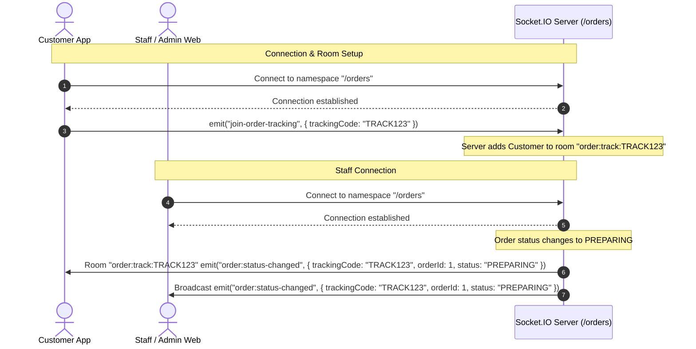

# WebSocket (Socket.IO) API Specification

This document details the real-time API endpoints, event payloads, and room management implemented in the backend via **Socket.IO**. 

---

## 1. Connection Details

The backend utilizes Socket.IO for real-time bi-directional communication.

- **Endpoint URL**: `ws://<host>:<port>/orders` (or `http` fallback with polling)
- **Namespace**: `/orders`
- **Socket.IO Version**: v4.x compatible
- **Authentication**: Anonymous / No auth required in the current MVP. All events can be listened to or triggered anonymously.

### Quick Connection Example (JavaScript Client)

```javascript
import { io } from "socket.io-client";

const socket = io("http://localhost:3000/orders", {
  transports: ["websocket"] // force WebSocket protocol
});

socket.on("connect", () => {
  console.log("Connected to /orders namespace with ID:", socket.id);
});
```

---

## 2. Rooms

### `order:track:{trackingCode}`
A customer-specific room designed for tracking the lifecycle of an order without receiving notifications for other tables.

- **Subscribing**: Send the client-to-server event `join-order-tracking`.
- **Target Audience**: Customer App tracking a single order.

---

## 3. Client-to-Server Events (Incoming)

These are events that a client (Customer App or Web Admin) emits to the server.

### `join-order-tracking`
Allows a customer client to join the tracking room for their order.

* **Payload Structure**:
  ```json
  {
    "trackingCode": "string (UUID v4)"
  }
  ```
* **Example**:
  ```javascript
  socket.emit("join-order-tracking", { trackingCode: "3f9b88d2-4ee1-4770-bdc9-b7b5f543ad0d" });
  ```
* **Server Action**: Joins the socket to the room `"order:track:3f9b88d2-4ee1-4770-bdc9-b7b5f543ad0d"`.

---

## 4. Server-to-Client Events (Outgoing)

These are events that the server emits to connected clients.

### 4.1. `order:new`
Broadcasted to all connected clients when a new order is successfully created. Used by the staff dashboard/kitchen view.

* **Audience**: Broadcasted to all connected sockets in the `/orders` namespace.
* **Payload Structure**:
  ```json
  {
    "orderId": "number",
    "tableId": "string (UUID v4)",
    "totalAmount": "number (decimal)",
    "status": "string (OrderStatus)"
  }
  ```
* **Payload Enum (`OrderStatus`)**: `"NEW"`
* **Example Payload**:
  ```json
  {
    "orderId": 42,
    "tableId": "a9a3b680-e83c-4824-9b57-df4cd2f31b81",
    "totalAmount": 150.00,
    "status": "NEW"
  }
  ```

### 4.2. `order:status-changed`
Emitted when an order transitions to a new state (e.g. `PREPARING`, `SERVED`, `PAID`, `CANCEL`).

* **Audience**: 
  1. Broadcasted to all connected sockets (for Staff Order Board).
  2. Sent specifically to the room `order:track:{trackingCode}` (for the specific Customer App).
* **Payload Structure**:
  ```json
  {
    "trackingCode": "string (UUID v4)",
    "orderId": "number",
    "status": "string (OrderStatus)"
  }
  ```
* **Payload Enum (`OrderStatus`)**: `"NEW" | "PREPARING" | "SERVED" | "PAID" | "CANCEL"`
* **Example Payload**:
  ```json
  {
    "trackingCode": "3f9b88d2-4ee1-4770-bdc9-b7b5f543ad0d",
    "orderId": 42,
    "status": "PREPARING"
  }
  ```

### 4.3. `table:status-changed`
Emitted when a table's operational status is toggled.

* **Audience**: Broadcasted to all connected sockets.
* **Payload Structure**:
  ```json
  {
    "tableId": "string (UUID v4)",
    "status": "string (TableStatus)"
  }
  ```
* **Payload Enum (`TableStatus`)**: `"AVAILABLE" | "CLOSED" | "OCCUPIED"`
* **Example Payload**:
  ```json
  {
    "tableId": "a9a3b680-e83c-4824-9b57-df4cd2f31b81",
    "status": "CLOSED"
  }
  ```

### 4.4. `menu:item-availability-changed`
Emitted when a menu item is marked out of stock or back in stock. The Customer App uses this event to immediately toggle the state of the "Add to Cart" button for that item without requiring a page refresh.

* **Audience**: Broadcasted to all connected sockets.
* **Payload Structure**:
  ```json
  {
    "itemId": "number",
    "isRemain": "boolean"
  }
  ```
* **Example Payload**:
  ```json
  {
    "itemId": 15,
    "isRemain": false
  }
  ```

---

## 5. Flow Diagram

Refer to the sequence diagram below illustrating room subscription and event broadcasting:


